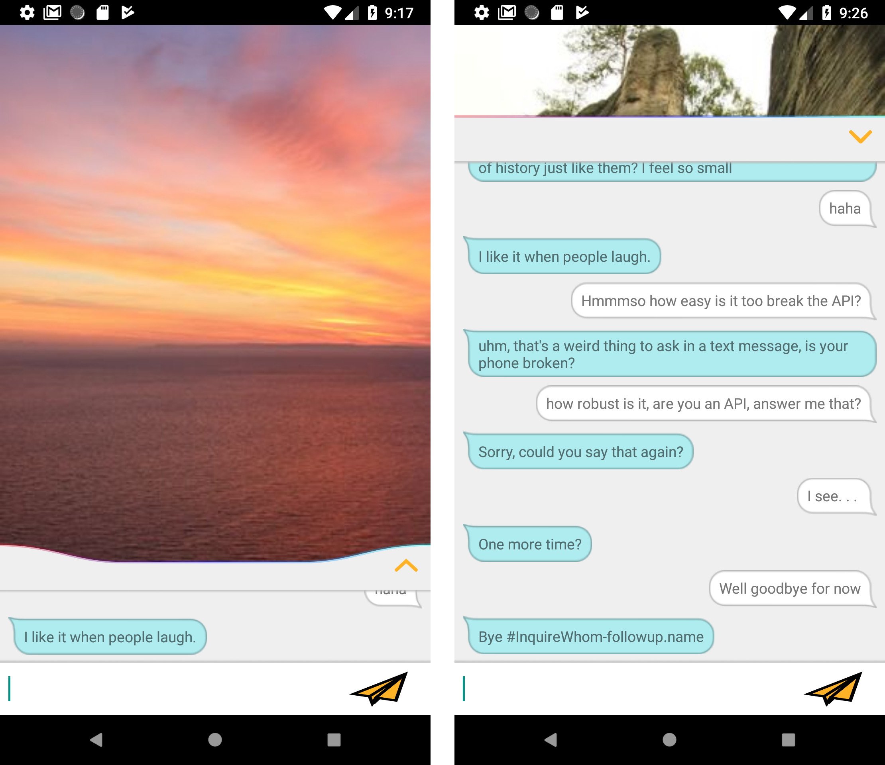

# Jocelyn

Experimenting with DialogFlow API and creating a natural language chat-bot.

Current impression: There is a distinct sense of lack of magic once you get past the pre-learned small talk templates. A lot of build-dialog-trees-manually work required.
